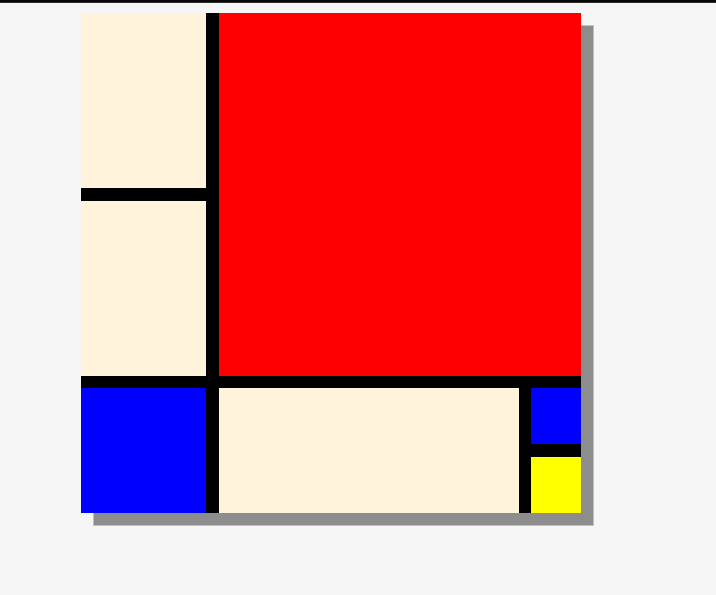

# Mondrian Project 

This project is a simple recreation of Piet Mondrian's abstract art using HTML and CSS. The goal is to design a responsive layout with different colored rectangles, inspired by Mondrian's signature style of grid-based compositions.

## Project Structure

- `index.html`: Contains the structure of the Mondrian-style grid using HTML elements.
- Styling is handled directly within the `style` tag in the HTML file.

## Design

The layout is built using CSS Grid to create a dynamic grid pattern with varied colored sections. The project focuses on experimenting with grid areas, spans, and column/row gaps to replicate the Mondrian-style artwork.

### Features

- **HTML5 and CSS3**: Uses modern HTML5 structure and CSS3 features.
- **Grid Layout**: Built entirely with CSS Grid, allowing flexible row and column design.
- **Responsive Design**: The grid adapts well to different screen sizes.

### Screenshot



## How to Use

1. Clone the repository:
   ```bash
   git clone https:/Krithika-N-4/github.com//Mondrian-Painting.git
